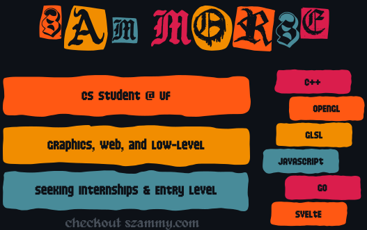

<!--# Hi, I'm Sam
A student developer currently looking for internship opportunities

            
---

-->

<!--

  

  
  
  
  
  
  
  

  Student @ UF 
Specializing in graphics, web, and low-level programming

-->
<!--ff5813
f18d00
488b99
da1d4c-->
<!--

  

-->

 
 
  
 
